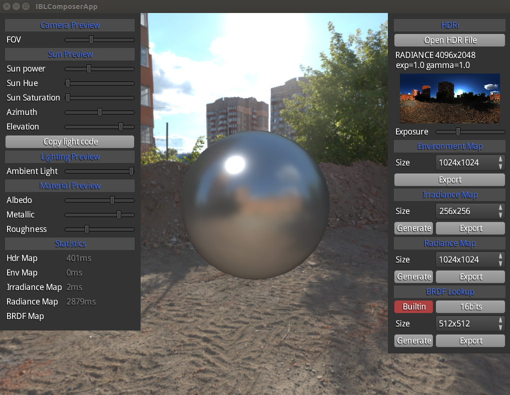

# How it works

PBR shader is using 3 textures : 

* a diffuse cubemap (irrandiance) used as global lighting.
* a specualar cubemap with mipmaps (radiance) used for roughness/metallic simulation.
* a shading lookup texture (LUT) used to shade efficently (it's included in the library).

additionally, you may want a consistent skybox via an environment texture.

you then end up with 4 textures.

Typically you can generate them from a HDRi.

This library provides a quick way to generate them at runtime, see IBLBuilder class and quick start example.

# About HDRi

## Get some free HDRi

There are several website providing free HDR images, a good one is [HDRi Haven](https://hdrihaven.com/hdris/)

## Make your own

You can use Blender to do this. Please take a look at this [Video tutorial](https://www.youtube.com/watch?v=a48PBPRO8O8). 
It's based on Blender 2.7x but should work with Blender 2.8x.
Note that this tutorial ommited to say your render resolution should be 2:1 (eg. 4096x2048)

# How to generate them

This repository provides a tool called "IBL Composer" to do generate these textures from an HDR image. Since it's libGDX based, it's supported for Windows, Mac, and Linux.
IBL generation algorithms are directly based on Learn OpenGL articles : [Diffuse irradiance](https://learnopengl.com/PBR/IBL/Diffuse-irradiance) and [Specular IBL](https://learnopengl.com/PBR/IBL/Specular-IBL)

Alternatively, there are several existing tools to accomplish the same things : 

* IBL baker (windows only)
* CubeMapGen from AMD (windows only)
* Cubemap Filter Tool (windows/mac/linux)

## generate using IBL Composer

You can build IBL composer locally from source or download latest version from [releases section](https://github.com/mgsx-dev/gdx-gltf/releases)

This tools provides export features and preview. Typical process is the following : Once a HDRI file loaded you can :

* load a HDRI file
* tweak exposure
* export environement maps, irradiance maps, and radiance maps at various resolutions

Notes: 

* BRDF lookup texture is not related to loaded HDRI and gdx-gltf already provides one out of the box, but you can also export and use a new one for your needs.
* This tools can be used to generate environement maps only when not used for PBR shading.

## generate using Cubemap Filter Tool (CMFT)

Cubemap Filter Tool provide both a CLI version and a GUI version : 

* CLI repository : https://github.com/dariomanesku/cmft
* CLI binaries : https://github.com/dariomanesku/cmft-bin
* GUI repository : https://github.com/dariomanesku/cmftStudio
* GUI binaries : https://github.com/dariomanesku/cmftStudio-bin

In this guide we will use the CLI version.

You can run `cmft --help` in order to have common cases examples.

Alternatively, you can use one of provided scripts from this repository, either :
* a full featured one using Ruby: **tools/cubemap.rb**
* a simpler one using Windows Batch: **tools/cubemap.bat**
It demonstrate automation process and can be easily adapted to any other script languages depending on your needs.

Alternative map sets in this repository has been generated with this script from HRDi Haven images : 

* demo1 : [simons_town_rocks_4k.hdr](https://hdrihaven.com/hdri/?c=nature&h=simons_town_rocks)
* demo2 : [kloofendal_48d_partly_cloudy_2k.hdr](https://hdrihaven.com/hdri/?c=nature&h=kloofendal_48d_partly_cloudy)
